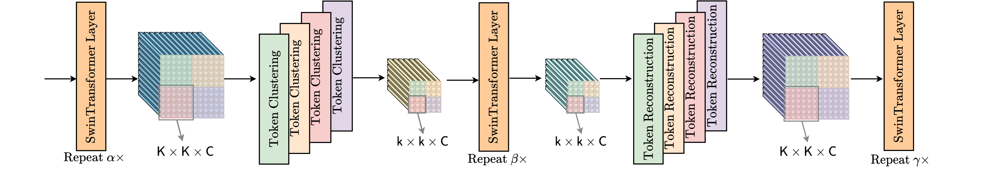
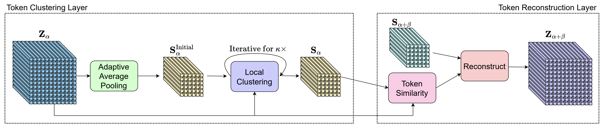
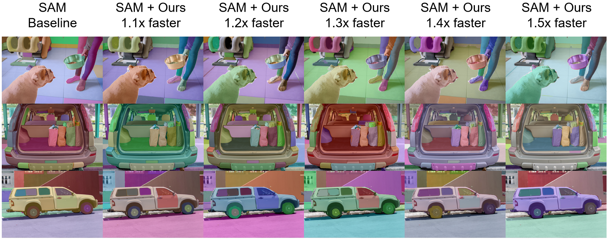
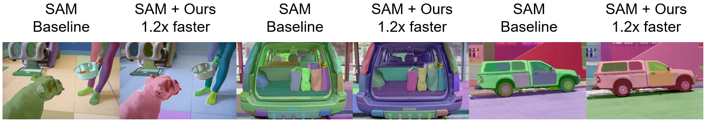

# Expediting Large-Scale Vision Transformer for Dense Prediction without Fine-tuning

<!-- **[Meta AI Research, FAIR](https://ai.facebook.com/research/)**

[Alexander Kirillov](https://alexander-kirillov.github.io/), [Eric Mintun](https://ericmintun.github.io/), [Nikhila Ravi](https://nikhilaravi.com/), [Hanzi Mao](https://hanzimao.me/), Chloe Rolland, Laura Gustafson, [Tete Xiao](https://tetexiao.com), [Spencer Whitehead](https://www.spencerwhitehead.com/), Alex Berg, Wan-Yen Lo, [Piotr Dollar](https://pdollar.github.io/), [Ross Girshick](https://www.rossgirshick.info/)

[[`Paper`](https://ai.facebook.com/research/publications/segment-anything/)] [[`Project`](https://segment-anything.com/)] [[`Demo`](https://segment-anything.com/demo)] [[`Dataset`](https://segment-anything.com/dataset/index.html)] [[`Blog`](https://ai.facebook.com/blog/segment-anything-foundation-model-image-segmentation/)] [[`BibTeX`](#citing-segment-anything)]


The **Segment Anything Model (SAM)** produces high quality object masks from input prompts such as points or boxes, and it can be used to generate masks for all objects in an image. It has been trained on a [dataset](https://segment-anything.com/dataset/index.html) of 11 million images and 1.1 billion masks, and has strong zero-shot performance on a variety of segmentation tasks.

<p float="left">
  
   
</p> -->

## Introduction

This is the official implementation of the paper "[Expediting Large-Scale Vision Transformer for Dense Prediction without Fine-tuning](https://arxiv.org/abs/2210.01035)" on [Segment Anything Model (SAM)](https://segment-anything.com/).




Our method can speed up SAM without any training. The bottleneck of SAM is image encoder. We implement our method on image encoder to signifficantly speed up the generation process. We test our method on different SAM models using a single 16G Tesla-V100. We set `--points-per-side=12` and `--points-per-batch=144` so that the generation process executes only one time.

| Model            | clustering location | num of clusters | speed(image/s)     |
| ---------------- | ------------------- | --------------- | ------------------ |
| SAM-ViT-H        | -                   | -               | 1.27               |
| SAM-ViT-H + ours | 18                   | 121             | 1.40(1.10x faster) |
| SAM-ViT-H + ours | 14                   | 100             | 1.52(1.19x faster) |
| SAM-ViT-H + ours | 8                   | 100             | 1.64(1.30x faster) |
| SAM-ViT-H + ours | 8                   | 81              | 1.82(1.44x faster) |
| SAM-ViT-H + ours | 6                   | 81              | 1.89(1.49x faster) |

Here is the visualization of the setting above.



We also try to implement our method on smaller model. Here are some examples generate by SAM w/ ViT-L + ours, with the setting of `--points-per-side=16` and `--points-per-batch=256`.  



## Installation

The code requires `python>=3.8`, as well as `pytorch>=1.7` and `torchvision>=0.8`. Please follow the instructions [here](https://pytorch.org/get-started/locally/) to install both PyTorch and TorchVision dependencies. Installing both PyTorch and TorchVision with CUDA support is strongly recommended.

<!-- Install Segment Anything:

```
pip install git+https://github.com/facebookresearch/segment-anything.git
```

or clone the repository locally and install with -->

To use Segment Anything with our method, please clone this repository locally and install with

```
pip install -e .
```

The following optional dependencies are necessary for mask post-processing, saving masks in COCO format, the example notebooks, and exporting the model in ONNX format. `jupyter` is also required to run the example notebooks.
```
pip install opencv-python pycocotools matplotlib onnxruntime onnx
```


## <a name="GettingStarted"></a>Getting Started

You can run the code like using original Segment Anything Model. The only difference is that you need to add `use_hourglass=True` as parameter while calling `build_sam` function. Here is an example.

First download a [model checkpoint](#model-checkpoints). Then the model can be used in just a few lines to get masks from a given prompt:

```
from segment_anything import build_sam, SamPredictor 
predictor = SamPredictor(build_sam(checkpoint="</path/to/model.pth>", use_hourglass=True))
predictor.set_image(<your_image>)
masks, _, _ = predictor.predict(<input_prompts>)
```

or generate masks for an entire image:

```
from segment_anything import build_sam, SamAutomaticMaskGenerator
mask_generator = SamAutomaticMaskGenerator(build_sam(checkpoint="</path/to/model.pth>", use_hourglass=True))
masks = mask_generator.generate(<your_image>)
```

Additionally, masks can be generated for images from the command line:

```
python scripts/amg.py --checkpoint <path/to/sam/checkpoint> --input <image_or_folder> --output <output_directory> --use_hourglass
```

You need to add `--use_hourglass` if you want to use our method to accelerate the process.


## <a name="Models"></a>Model Checkpoints

<!-- Three model versions of the model are available with different backbone sizes. These models can be instantiated by running 
```
from segment_anything import sam_model_registry
sam = sam_model_registry["<name>"](checkpoint="<path/to/checkpoint>")
```
Click the links below to download the checkpoint for the corresponding model name. The default model in bold can also be instantiated with `build_sam`, as in the examples in [Getting Started](#getting-started). -->

Here are the official weight of SAM model.

* **`default` or `vit_h`: [ViT-H SAM model.](https://dl.fbaipublicfiles.com/segment_anything/sam_vit_h_4b8939.pth)**
* `vit_l`: [ViT-L SAM model.](https://dl.fbaipublicfiles.com/segment_anything/sam_vit_l_0b3195.pth)
* `vit_b`: [ViT-B SAM model.](https://dl.fbaipublicfiles.com/segment_anything/sam_vit_b_01ec64.pth)

## License
The model is licensed under the [Apache 2.0 license](LICENSE).

## Citation

If you find this repo useful in your research, please consider citing:

```latex
@article{liang2022expediting,
	author    = {Liang, Weicong and Yuan, Yuhui and Ding, Henghui and Luo, Xiao and Lin, Weihong and Jia, Ding and Zhang, Zheng and Zhang, Chao and Hu, Han},
	title     = {Expediting large-scale vision transformer for dense prediction without fine-tuning},
	journal   = {arXiv preprint arXiv:2210.01035},
	year      = {2022},
}
```

If you use SAM or SA-1B in your research, please use the following BibTeX entry. 

```
@article{kirillov2023segany,
  title={Segment Anything}, 
  author={Kirillov, Alexander and Mintun, Eric and Ravi, Nikhila and Mao, Hanzi and Rolland, Chloe and Gustafson, Laura and Xiao, Tete and Whitehead, Spencer and Berg, Alexander C. and Lo, Wan-Yen and Doll{\'a}r, Piotr and Girshick, Ross},
  journal={arXiv:2304.02643},
  year={2023}
}
```
